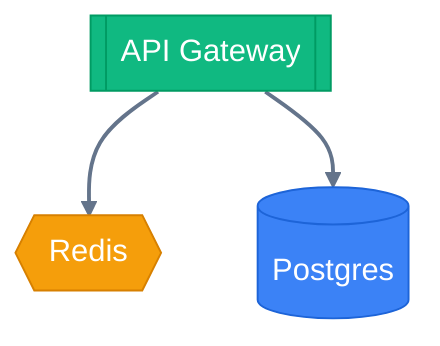
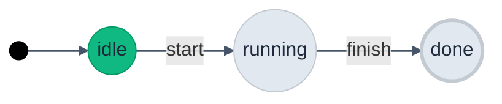
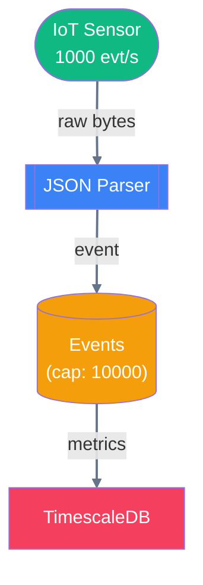
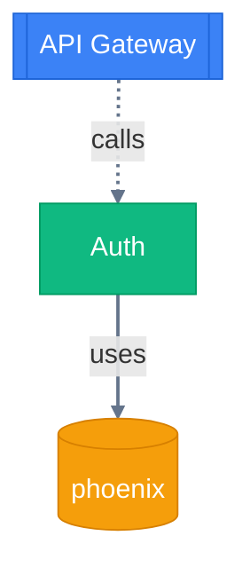
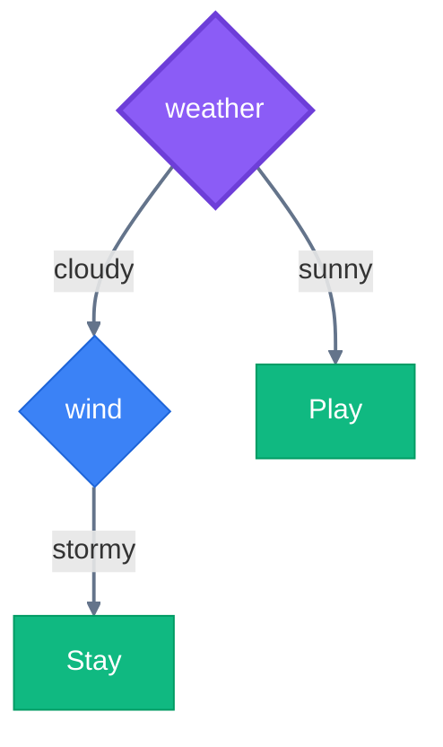
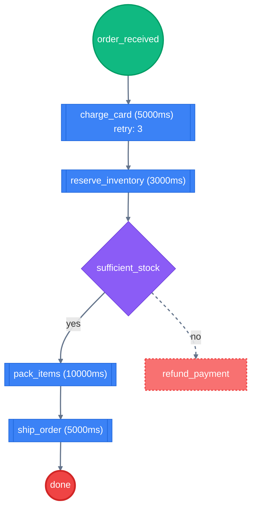
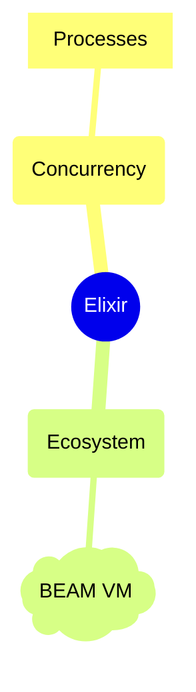
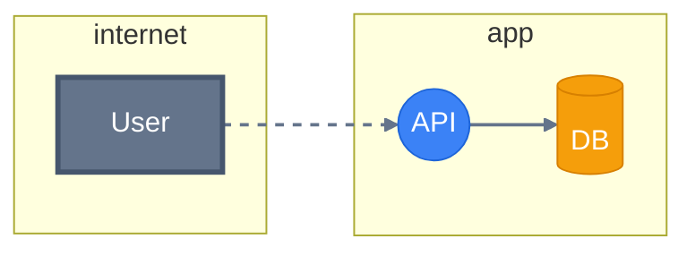
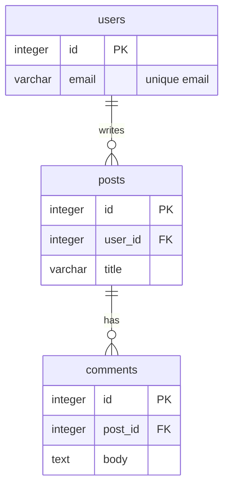

# Choreo

[](https://hex.pm/packages/choreo)
[](https://hexdocs.pm/choreo/)
[](https://github.com/code-shoily/choreo/actions)
[](https://coveralls.io/github/code-shoily/choreo?branch=main)
[](https://opensource.org/licenses/MIT)

> Domain-specific diagram builders and graph analyzers on top of [Yog](https://github.com/code-shoily/yog_ex).

Choreo is a family of Elixir libraries that let you model, analyze, and render complex systems as graphs. Instead of drawing boxes and arrows by hand, you write code. Instead of static pictures, you get live analysis — reachability, cycles, bottlenecks, threat generation, and more.

```elixir
alias Choreo.Dataflow

# A dataflow pipeline with one line of analysis
pipeline =
  Dataflow.new()
  |> Dataflow.add_source(:sensor)
  |> Dataflow.add_transform(:parse)
  |> Dataflow.add_sink(:db)
  |> Dataflow.connect(:sensor, :parse)
  |> Dataflow.connect(:parse, :db)

Dataflow.Analysis.cyclic?(pipeline)      #=> false
Dataflow.to_dot(pipeline)                #=> DOT string
Dataflow.to_mermaid(pipeline)            #=> Mermaid.js string
```

---

## Table of Contents

- [Why Choreo?](#why-choreo)
- [Installation](#installation)
- [Graph Analysis & Heatmaps](#graph-analysis--heatmaps)
- [Modules](#modules)
  - [Choreo — Infrastructure Architecture](#choreo--infrastructure-architecture)
  - [Choreo.FSM — Finite State Machines](#choreofsm--finite-state-machines)
  - [Choreo.Dataflow — Pipeline Diagrams](#choreodataflow--pipeline-diagrams)
  - [Choreo.Dependency — Software Dependency Graphs](#choreodependency--software-dependency-graphs)
  - [Choreo.DecisionTree — Classification Trees](#choreodecisiontree--classification-trees)
  - [Choreo.MindMap — Concept Mapping](#choreomindmap--concept-mapping)
  - [Choreo.ThreatModel — STRIDE Threat Modeling](#choreothreatmodel--stride-threat-modeling)
  - [Choreo.Workflow — Task Orchestration](#choreoworkflow--task-orchestration)
- [Themes & Rendering](#themes--rendering)
- [Testing](#testing)
- [Roadmap](#roadmap)

---

## Why Choreo?

Most diagramming tools are **visualization-only**: you describe a picture, you get a picture.

Choreo is **analysis-first**: you describe a system, you get answers.

| Question | Choreo answer |
|----------|-----------------|
| "Can this state machine accept input `X`?" | `Choreo.FSM.Analysis.accepts?(fsm, ["X"])` |
| "Is my pipeline cyclic?" | `Choreo.Dataflow.Analysis.cyclic?(pipeline)` |
| "What breaks if I change `:auth`?" | `Choreo.Dependency.Analysis.affected_by(deps, :auth)` |
| "What's the slowest path end-to-end?" | `Choreo.Dataflow.Analysis.longest_path(pipeline)` |
| "Are there circular dependencies?" | `Choreo.Dependency.Analysis.cyclic_dependencies(deps)` |
| "What threats exist in my architecture?" | `Choreo.ThreatModel.Analysis.stride_threats(model)` |
| "Which feature drives the most splits?" | `Choreo.DecisionTree.Analysis.feature_importance(tree)` |
| "How deep is this mind map?" | `Choreo.MindMap.Analysis.depth(map)` |
| "Which ideas are orphaned?" | `Choreo.MindMap.Analysis.orphan_nodes(map)` |
| "What's the shortest path from A to B?" | `Choreo.View.focus_between(map, :a, :b)` |
| "Collapse these nodes into one?" | `Choreo.View.collapse(map, pred, :agg)` |

Everything renders to **DOT (Graphviz)** for publication-quality output and **Mermaid.js** for native rendering in GitHub, GitLab, Notion, and Livebook — with built-in `:default`, `:dark`, `:warm`, `:forest`, `:ocean`, and custom themes.

---

## Graph Analysis & Heatmaps

Choreo provides powerful graph analysis tools to identify "hotspots" in your architecture, workflows, and pipelines. Use `heatmap/2` to automatically color nodes based on importance or performance metrics.

| Metric | Measure | Question | Best for |
|--------|---------|----------|----------|
| **Structural Importance** | Betweenness Centrality | "Which nodes are critical bridges/connectors?" | `Choreo`, `Dependency` |
| **Connectivity** | Degree Centrality | "Which nodes have the most connections?" | `MindMap`, `Dependency` |
| **SPOF Detection** | Articulation Points | "Which nodes would disconnect the system if they failed?" | `Choreo`, `Dataflow` |
| **Nucleus Detection** | K-Core Decomposition | "Which nodes form the most tightly-coupled core?" | `Choreo`, `Dependency` |
| **Dependency Reduction** | Transitive Reduction | "What is the minimal set of dependencies that preserve reachability?" | `Dependency` |
| **Path Analysis** | Dijkstra / Widest Path | "What is the fastest or highest-throughput path between two points?" | `Workflow`, `Dataflow` |
| **Execution Hotspots** | Latency Heatmap | "Which tasks slow down the entire workflow?" | `Workflow` |
| **Volume Hotspots** | Throughput Heatmap | "Which stages handle the most data volume?" | `Dataflow` |
| **Security Hotspots** | Risk Heatmap | "Which components have the most security threats?" | `ThreatModel` |

```elixir
# Example: Visualizing security risk hotspots
model = Choreo.ThreatModel.Analysis.heatmap(model, palette: :heat)
Choreo.ThreatModel.to_dot(model)

# Example: Transitive Reduction for dependency cleanup
{:ok, reduced} = Choreo.Analysis.reduce_transitive(deps)

# Example: Finding and highlighting the fastest path
{:ok, path} = Choreo.Analysis.path(wf, :start, :done, measure: :latency)
Choreo.Workflow.to_dot(wf, Choreo.Analysis.highlight(path))

# Example: Custom weighted pathfinding (e.g. by 'cost')
{:ok, path} = Choreo.Analysis.path(system, :a, :b, measure: :cost)
dot = Choreo.Workflow.to_dot(wf, Choreo.Analysis.highlight(path))
```

---

## Installation

Add `choreo` to your `mix.exs`:

```elixir
def deps do
  [
    {:choreo, "~> 0.8"}
  ]
end
```

---

## Modules

### Choreo — Infrastructure Architecture

Model systems with typed infrastructure nodes: databases, caches, services, queues, load balancers, networks, users, and storage.

```elixir
alias Choreo

system =
  Choreo.new()
  |> Choreo.add_database(:db, name: "Postgres", kind: :postgres)
  |> Choreo.add_cache(:cache, name: "Redis")
  |> Choreo.add_service(:api, name: "API Gateway")
  |> Choreo.connect(:api, :cache, cost: 5)
  |> Choreo.connect(:api, :db, cost: 10)

# Analysis
{:ok, mst} = Choreo.Analysis.mst(system)
{:ok, order} = Choreo.Analysis.topological_sort(system)

# Render
dot = Choreo.to_dot(system, theme: :dark)
mermaid = Choreo.to_mermaid(system)
```

**Features:** clusters with nesting, dataflow edges, cost-weighted edges, MST, topological sort, SCC, theming.



---

### Choreo.FSM — Finite State Machines

Classic state machines with initial states, final states, and labeled transitions.

```elixir
alias Choreo.FSM

fsm =
  FSM.new()
  |> FSM.add_initial_state(:idle)
  |> FSM.add_state(:running)
  |> FSM.add_final_state(:done)
  |> FSM.add_transition(:idle, :running, label: "start")
  |> FSM.add_transition(:running, :done, label: "finish")

# Analysis
FSM.Analysis.accepts?(fsm, ["start", "finish"])  #=> true
FSM.Analysis.deterministic?(fsm)                  #=> true
FSM.Analysis.shortest_accepting_path(fsm)         #=> {:ok, ["start", "finish"]}
# Transforms
pruned = FSM.prune(fsm)
```

**Features:** Deterministic execution, reachability, dead-state detection, determinism check, complement, product construction, equivalence checking.



---

### Choreo.Dataflow — Pipeline Diagrams

Model stream-processing and ETL pipelines. Nodes are sources, transforms, buffers, conditionals, merges, and sinks.

```elixir
alias Choreo.Dataflow

pipeline =
  Dataflow.new()
  |> Dataflow.add_source(:sensor, label: "IoT Sensor", rate: 1000)
  |> Dataflow.add_transform(:parse, label: "JSON Parser", latency_ms: 50)
  |> Dataflow.add_buffer(:kafka, label: "Events", capacity: 10_000)
  |> Dataflow.add_sink(:db, label: "TimescaleDB")
  |> Dataflow.connect(:sensor, :parse, data_type: "raw bytes")
  |> Dataflow.connect(:parse, :kafka, data_type: "event")
  |> Dataflow.connect(:kafka, :db, data_type: "metrics")

# Analysis
Dataflow.Analysis.cyclic?(pipeline)           #=> false
{:ok, order} = Dataflow.Analysis.topological_sort(pipeline)
Dataflow.Analysis.orphan_nodes(pipeline)       #=> []
Dataflow.Analysis.bottlenecks(pipeline)        #=> [:kafka]
Dataflow.Analysis.simulate(pipeline)           #=> throughput map
{:ok, path, latency} = Dataflow.Analysis.longest_path(pipeline)
```

**Features:** error/retry/dead-letter path types, sub-pipeline clusters, throughput simulation, backpressure detection, critical-path analysis.



---

### Choreo.Dependency — Software Dependency Graphs

Map modules, libraries, applications, interfaces, and tests. Detect circular dependencies, layering violations, and impact zones.

```elixir
alias Choreo.Dependency

deps =
  Dependency.new()
  |> Dependency.add_application(:api, label: "API Gateway")
  |> Dependency.add_module(:auth, label: "Auth")
  |> Dependency.add_library(:phoenix)
  |> Dependency.depends_on(:api, :auth, type: :calls)
  |> Dependency.depends_on(:auth, :phoenix, type: :uses)

# Analysis
Dependency.Analysis.cyclic_dependencies(deps)     #=> []
Dependency.Analysis.affected_by(deps, :auth)       #=> [:api]
Dependency.Analysis.depends_on(deps, :api)         #=> [:auth, :phoenix]

# Layer enforcement
layers = %{repo: 1, service: 2, api: 3}
Dependency.Analysis.layer_violations(deps, layers)
```

**Features:** cycle path extraction (not just boolean), transitive impact analysis, layer violation detection, centrality ranking, longest dependency chain, cycle edge highlighting in DOT.



---

### Choreo.DecisionTree — Classification Trees

Build decision trees with enforced tree invariants (single root, single parent, no cycles).

```elixir
alias Choreo.DecisionTree
alias Choreo.DecisionTree.Analysis

tree =
  DecisionTree.new()
  |> DecisionTree.set_root(:weather, feature: "weather")
  |> DecisionTree.add_decision(:wind, feature: "wind")
  |> DecisionTree.add_outcome(:play, label: "Play", class: "yes")
  |> DecisionTree.add_outcome(:stay, label: "Stay", class: "no")
  |> DecisionTree.branch(:weather, :wind, "cloudy")
  |> DecisionTree.branch(:weather, :play, "sunny")
  |> DecisionTree.branch(:wind, :stay, "stormy")

# Evaluation
Analysis.decide(tree, %{"weather" => "cloudy", "wind" => "calm"})
#=> {:ok, [:weather, :wind, ...], "..."}

# Metrics
Analysis.paths(tree)               #=> all root-to-leaf paths
Analysis.depth(tree)               #=> 2
Analysis.feature_importance(tree)  #=> %{"weather" => 1, "wind" => 1}

# Optimization
pruned = Analysis.prune_redundant(tree)
```

**Features:** exact-match decision evaluation, path enumeration with conditions, redundant-branch pruning, feature-importance counting, tree validation.



---

### Choreo.Workflow — Task Orchestration

Model automated task orchestration with Saga-pattern compensations, timeouts, retries, and conditional branching.

```elixir
alias Choreo.Workflow
alias Choreo.Workflow.Analysis

workflow =
  Workflow.new()
  |> Workflow.add_start(:order_received)
  |> Workflow.add_task(:charge_card, timeout_ms: 5000, retry: 3)
  |> Workflow.add_task(:reserve_inventory, timeout_ms: 3000)
  |> Workflow.add_decision(:sufficient_stock)
  |> Workflow.add_task(:pack_items, timeout_ms: 10_000)
  |> Workflow.add_task(:ship_order, timeout_ms: 5000)
  |> Workflow.add_compensation(:refund_payment, for: :charge_card)
  |> Workflow.add_end(:done)
  |> Workflow.connect(:order_received, :charge_card)
  |> Workflow.connect(:charge_card, :reserve_inventory)
  |> Workflow.connect(:reserve_inventory, :sufficient_stock)
  |> Workflow.connect(:sufficient_stock, :pack_items, condition: "yes")
  |> Workflow.connect(:sufficient_stock, :refund_payment, condition: "no", edge_type: :compensation)
  |> Workflow.connect(:pack_items, :ship_order)
  |> Workflow.connect(:ship_order, :done)

# Analysis
Analysis.critical_path(workflow)
#=> {:ok, [:order_received, :charge_card, ...], 23000}

Analysis.parallelizable_tasks(workflow)
Analysis.missing_compensations(workflow)
Analysis.validate(workflow)
```

**Features:** critical-path analysis with latency weights, parallelizable-task grouping, failure-scenario detection, missing-compensation detection, bottleneck detection, execution simulation.



---

### Choreo.MindMap — Concept Mapping

Model hierarchical concept maps with a central root, branching topics and subtopics, and associative cross-links.

```elixir
alias Choreo.MindMap
alias Choreo.MindMap.Analysis

map =
  MindMap.new()
  |> MindMap.set_root(:elixir, label: "Elixir")
  |> MindMap.add_topic(:concurrency, label: "Concurrency")
  |> MindMap.add_topic(:ecosystem, label: "Ecosystem")
  |> MindMap.add_subtopic(:processes, label: "Processes")
  |> MindMap.add_note(:beam, label: "BEAM VM")
  |> MindMap.branch(:elixir, :concurrency)
  |> MindMap.branch(:elixir, :ecosystem)
  |> MindMap.branch(:concurrency, :processes)
  |> MindMap.branch(:ecosystem, :beam)
  |> MindMap.associate(:processes, :beam, label: "runs on")

# Analysis
Analysis.depth(map)          #=> 2
Analysis.breadth(map)        #=> 2
Analysis.orphan_nodes(map)   #=> []
Analysis.paths(map)          #=> [[:elixir, :concurrency, :processes], [:elixir, :ecosystem, :beam]]
Analysis.validate(map)       #=> []
```

**Features:** single-root invariant, branch and associate edge types, depth/breadth/width metrics, root-to-leaf path enumeration, orphan detection, cycle detection, type-frequency analysis, validation.



---

### Choreo.ThreatModel — STRIDE Threat Modeling

Extend dataflow diagrams with security semantics. Auto-generate STRIDE threats based on element types, trust boundaries, and encryption status.

```elixir
alias Choreo.ThreatModel
alias Choreo.ThreatModel.Analysis

model =
  ThreatModel.new()
  |> ThreatModel.add_trust_boundary("internet", level: 0)
  |> ThreatModel.add_trust_boundary("app", level: 2)
  |> ThreatModel.add_external_entity(:user, boundary: "internet", label: "User")
  |> ThreatModel.add_process(:api, boundary: "app", privilege: :admin, label: "API")
  |> ThreatModel.add_data_store(:db, boundary: "app", sensitivity: :confidential, label: "DB")
  |> ThreatModel.data_flow(:user, :api)
  |> ThreatModel.data_flow(:api, :db, encrypted: true)

# Auto-generated threats
threats = Analysis.stride_threats(model)
#=> [%{id: "T1", category: :spoofing, target: :user, severity: :high, ...}, ...]

# Security analysis
Analysis.exposed_data_stores(model)
Analysis.high_risk_processes(model)
Analysis.unencrypted_boundary_flows(model)

# Sequence diagram
ThreatModel.to_sequence(model)  #=> Mermaid sequenceDiagram string
```

**Features:** automated STRIDE threat generation with severity scoring, trust-boundary crossing detection, exposed-data-store identification, high-risk process detection, encrypted-flow detection, sequence diagram generation.



---

### Choreo.ERD — Database Entity-Relationship Modeling

Model database schemas, validate data integrity constraints, render beautiful HTML-like tables or native Mermaid `erDiagram` syntaxes, and run advanced topological analysis.

```elixir
alias Choreo.ERD
alias Choreo.ERD.Analysis

erd =
  ERD.new()
  |> ERD.add_table(:users, columns: [
    %{name: :id, type: :integer, key: :pk},
    %{name: :email, type: :varchar, comment: "unique email"}
  ])
  |> ERD.add_table(:posts, columns: [
    %{name: :id, type: :integer, key: :pk},
    %{name: :user_id, type: :integer, key: :fk},
    %{name: :title, type: :varchar}
  ])
  |> ERD.add_table(:comments, columns: [
    %{name: :id, type: :integer, key: :pk},
    %{name: :post_id, type: :integer, key: :fk},
    %{name: :body, type: :text}
  ])
  |> ERD.add_relationship(:users, :posts, cardinality: :one_to_many, label: "writes")
  |> ERD.add_relationship(:posts, :comments, cardinality: :one_to_many, label: "has")

# Topological Analysis
Analysis.shortest_join_path(erd, :users, :comments) #=> {:ok, [:users, :posts, :comments]}
Analysis.cycles(erd)                              #=> [] (no circular foreign keys!)
Analysis.orphans(erd)                             #=> []
Analysis.table_degrees(erd)                       #=> %{users: %{in: 0, out: 1, total: 1}, ...}
```

**Features:** strict columns and relationship validation, customizable themed HTML record labels in DOT output, native Mermaid `erDiagram` generation, undirected BFS join path solver, DFS circular foreign key cycle detection, orphan and coupling metrics.



---

## Themes & Rendering

All modules render to **DOT (Graphviz)** and **Mermaid.js** via a shared theming pipeline.

```elixir
# DOT output (Graphviz)
Choreo.to_dot(system, theme: :default)
Choreo.to_dot(system, theme: :dark)

# Mermaid.js output (GitHub, GitLab, Notion, Livebook)
Choreo.to_mermaid(system, theme: :default)
Choreo.to_mermaid(system, theme: :ocean)

# Custom theme
theme = Choreo.Theme.custom(
  colors: %{database: "#ff0000", service: "#00ff00"},
  graph_bgcolor: "#0f172a",
  node_fontcolor: "white"
)
Choreo.to_dot(system, theme: theme)
Choreo.to_mermaid(system, theme: theme)
```

### Built-in themes

| Theme | Description |
|-------|-------------|
| `:default` | Type-coloured nodes, white background |
| `:dark` | Dark background with neon accents |
| `:minimal` | Monochrome wireframe, no fills |
| `:warm` | Sunset palette, warm background |
| `:forest` | Lush green palette, earth tones |
| `:ocean` | Deep blue palette, cool background |

### Per-module node types

| Module | Node types | Shapes |
|--------|-----------|--------|
| `Choreo` | database, cache, service, queue, ... | cylinder, diamond, box3d, cloud, folder |
| `Choreo.FSM` | initial, normal, final | circle, doublecircle |
| `Choreo.Dataflow` | source, sink, transform, buffer, conditional, merge | house, invhouse, box3d, cylinder, diamond, trapezium |
| `Choreo.Dependency` | application, library, module, interface, test | box3d, cylinder, box, diamond, note |
| `Choreo.DecisionTree` | root, decision, outcome | diamond (double), diamond, rounded box |
| `Choreo.MindMap` | root, topic, subtopic, note | doublecircle, ellipse, rounded box, note |
| `Choreo.ThreatModel` | external_entity, process, data_store | box (double), circle, cylinder |
| `Choreo.Workflow` | start, end, task, decision, fork, join, compensation, event | circle, doublecircle, box3d, diamond, invhouse, house, note, cloud |

---

## Testing

```bash
mix test
```

All modules ship with comprehensive ExUnit test suites covering builders, analysis, rendering, and doctests:

**833 tests** (266 doctests + 567 unit tests), 0 failures.

---

## Roadmap

- [x] Infrastructure architecture diagrams (`Choreo`)
- [x] Finite state machines with analysis (`Choreo.FSM`)
- [x] Dataflow / pipeline diagrams (`Choreo.Dataflow`)
- [x] Software dependency graphs (`Choreo.Dependency`)
- [x] Decision trees (`Choreo.DecisionTree`)
- [x] STRIDE threat modeling (`Choreo.ThreatModel`)
- [x] Task orchestration workflows (`Choreo.Workflow`)
- [x] Mind maps (`Choreo.MindMap`)
- [x] Schema validation for dataflow edges
- [x] Custom theme presets and per-node style overrides
- [x] Centrality metrics, cut vertices, k-core decomposition
- [x] Cross-module composition (e.g. embed a Dataflow inside a Choreo cluster)
- [x] Validation framework across all modules
- [x] Mermaid.js rendering for all modules
- [x] Mermaid sequence diagrams (`ThreatModel`)
- [ ] Graph colouring algorithms
- [ ] Property-based testing suite

---

## License

MIT
