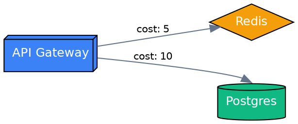
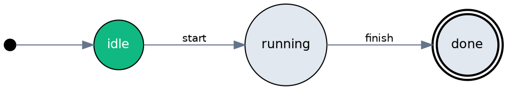
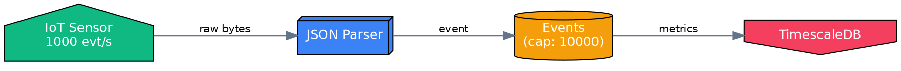
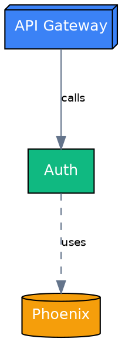
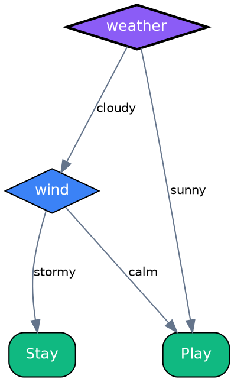
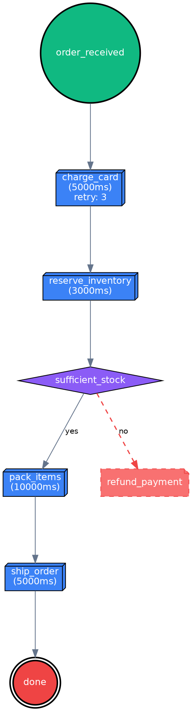
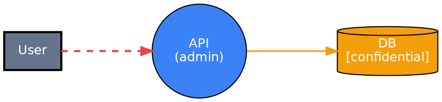

# Choreo

> Domain-specific diagram builders and graph analyzers on top of [Yog](https://github.com/code-shoily/yog_ex).

Choreo is a family of Elixir libraries that let you model, analyze, and render complex systems as graphs. Instead of drawing boxes and arrows by hand, you write code. Instead of static pictures, you get live analysis — reachability, cycles, bottlenecks, threat generation, and more.

```elixir
alias Choreo.Dataflow

# A dataflow pipeline with one line of analysis
pipeline =
  Dataflow.new()
  |> Dataflow.add_source(:sensor)
  |> Dataflow.add_transform(:parse)
  |> Dataflow.add_sink(:db)
  |> Dataflow.connect(:sensor, :parse)
  |> Dataflow.connect(:parse, :db)

Dataflow.Analysis.cyclic?(pipeline)      #=> false
Dataflow.to_dot(pipeline)                #=> DOT string
```

---

## Table of Contents

- [Why Choreo?](#why-choreo)
- [Installation](#installation)
- [Modules](#modules)
  - [Choreo — Infrastructure Architecture](#choreo--infrastructure-architecture)
  - [Choreo.FSM — Finite State Machines](#choreofsm--finite-state-machines)
  - [Choreo.Dataflow — Pipeline Diagrams](#choreodataflow--pipeline-diagrams)
  - [Choreo.Dependency — Software Dependency Graphs](#choreodependency--software-dependency-graphs)
  - [Choreo.DecisionTree — Classification Trees](#choreodecisiontree--classification-trees)
  - [Choreo.ThreatModel — STRIDE Threat Modeling](#choreothreatmodel--stride-threat-modeling)
  - [Choreo.Workflow — Task Orchestration](#choreoworkflow--task-orchestration)
- [Themes & Rendering](#themes--rendering)
- [Testing](#testing)
- [Roadmap](#roadmap)

---

## Why Choreo?

Most diagramming tools are **visualization-only**: you describe a picture, you get a picture.

Choreo is **analysis-first**: you describe a system, you get answers.

| Question | Choreo answer |
|----------|-----------------|
| "Can this state machine accept input `X`?" | `Choreo.FSM.Analysis.accepts?(fsm, ["X"])` |
| "Is my pipeline cyclic?" | `Choreo.Dataflow.Analysis.cyclic?(pipeline)` |
| "What breaks if I change `:auth`?" | `Choreo.Dependency.Analysis.affected_by(deps, :auth)` |
| "What's the slowest path end-to-end?" | `Choreo.Dataflow.Analysis.longest_path(pipeline)` |
| "Are there circular dependencies?" | `Choreo.Dependency.Analysis.cyclic_dependencies(deps)` |
| "What threats exist in my architecture?" | `Choreo.ThreatModel.Analysis.stride_threats(model)` |
| "Which feature drives the most splits?" | `Choreo.DecisionTree.Analysis.feature_importance(tree)` |

Everything renders to **DOT (Graphviz)** for publication-quality output with built-in `:default`, `:dark`, and custom themes.

---

## Installation

Add `choreo` to your `mix.exs`:

```elixir
def deps do
  [
    {:choreo, "~> 0.5"}
  ]
end
```

---

## Modules

### Choreo — Infrastructure Architecture

Model systems with typed infrastructure nodes: databases, caches, services, queues, load balancers, networks, users, and storage.

```elixir
alias Choreo

system =
  new()
  |> add_database(:db, name: "Postgres", kind: :postgres)
  |> add_cache(:cache, name: "Redis")
  |> add_service(:api, name: "API Gateway")
  |> connect(:api, :cache, cost: 5)
  |> connect(:api, :db, cost: 10)

# Analysis
{:ok, mst} = Analysis.mst(system)
{:ok, order} = Analysis.topological_sort(system)

# Render
dot = to_dot(system, theme: :dark)
```

**Features:** clusters with nesting, dataflow edges, cost-weighted edges, MST, topological sort, SCC, theming.



---

### Choreo.FSM — Finite State Machines

Classic state machines with initial states, final states, and labeled transitions.

```elixir
alias Choreo.FSM

fsm =
  FSM.new()
  |> FSM.add_initial_state(:idle)
  |> FSM.add_state(:running)
  |> FSM.add_final_state(:done)
  |> FSM.add_transition(:idle, :running, label: "start")
  |> FSM.add_transition(:running, :done, label: "finish")

# Analysis
FSM.Analysis.accepts?(fsm, ["start", "finish"])  #=> true
FSM.Analysis.deterministic?(fsm)                  #=> true
FSM.Analysis.shortest_accepting_path(fsm)         #=> {:ok, ["start", "finish"]}

# Transforms
pruned = FSM.prune(fsm)
```

**Features:** NFA simulation via subset construction, reachability, dead-state detection, determinism check, complement, product construction, equivalence checking.



---

### Choreo.Dataflow — Pipeline Diagrams

Model stream-processing and ETL pipelines. Nodes are sources, transforms, buffers, conditionals, merges, and sinks.

```elixir
alias Choreo.Dataflow

pipeline =
  Dataflow.new()
  |> Dataflow.add_source(:sensor, label: "IoT Sensor", rate: 1000)
  |> Dataflow.add_transform(:parse, label: "JSON Parser", latency_ms: 50)
  |> Dataflow.add_buffer(:kafka, label: "Events", capacity: 10_000)
  |> Dataflow.add_sink(:db, label: "TimescaleDB")
  |> Dataflow.connect(:sensor, :parse, data_type: "raw bytes")
  |> Dataflow.connect(:parse, :kafka, data_type: "event")
  |> Dataflow.connect(:kafka, :db, data_type: "metrics")

# Analysis
Dataflow.Analysis.cyclic?(pipeline)           #=> false
{:ok, order} = Dataflow.Analysis.topological_sort(pipeline)
Dataflow.Analysis.orphan_nodes(pipeline)       #=> []
Dataflow.Analysis.bottlenecks(pipeline)        #=> [:kafka]
Dataflow.Analysis.simulate(pipeline)           #=> throughput map
{:ok, path, latency} = Dataflow.Analysis.longest_path(pipeline)
```

**Features:** error/retry/dead-letter path types, sub-pipeline clusters, throughput simulation, backpressure detection, critical-path analysis.



---

### Choreo.Dependency — Software Dependency Graphs

Map modules, libraries, applications, interfaces, and tests. Detect circular dependencies, layering violations, and impact zones.

```elixir
alias Choreo.Dependency

deps =
  Dependency.new()
  |> Dependency.add_application(:api, label: "API Gateway")
  |> Dependency.add_module(:auth, label: "Auth")
  |> Dependency.add_library(:phoenix)
  |> Dependency.depends_on(:api, :auth, type: :calls)
  |> Dependency.depends_on(:auth, :phoenix, type: :uses)

# Analysis
Dependency.Analysis.cyclic_dependencies(deps)     #=> []
Dependency.Analysis.affected_by(deps, :auth)       #=> [:api]
Dependency.Analysis.depends_on(deps, :api)         #=> [:auth, :phoenix]

# Layer enforcement
layers = %{repo: 1, service: 2, api: 3}
Dependency.Analysis.layer_violations(deps, layers)
```

**Features:** cycle path extraction (not just boolean), transitive impact analysis, layer violation detection, centrality ranking, longest dependency chain, cycle edge highlighting in DOT.



---

### Choreo.DecisionTree — Classification Trees

Build decision trees with enforced tree invariants (single root, single parent, no cycles).

```elixir
alias Choreo.DecisionTree
alias Choreo.DecisionTree.Analysis

tree =
  DecisionTree.new()
  |> DecisionTree.set_root(:weather, feature: "weather")
  |> DecisionTree.add_decision(:wind, feature: "wind")
  |> DecisionTree.add_outcome(:play, label: "Play", class: "yes")
  |> DecisionTree.add_outcome(:stay, label: "Stay", class: "no")
  |> DecisionTree.branch(:weather, :wind, "cloudy")
  |> DecisionTree.branch(:weather, :play, "sunny")
  |> DecisionTree.branch(:wind, :play, "calm")
  |> DecisionTree.branch(:wind, :stay, "stormy")

# Evaluation
Analysis.decide(tree, %{"weather" => "cloudy", "wind" => "calm"})
#=> {:ok, [:weather, :wind, :play], "Play"}

# Metrics
Analysis.paths(tree)               #=> all root-to-leaf paths
Analysis.depth(tree)               #=> 2
Analysis.feature_importance(tree)  #=> %{"weather" => 1, "wind" => 1}

# Optimization
pruned = Analysis.prune_redundant(tree)
```

**Features:** exact-match decision evaluation, path enumeration with conditions, redundant-branch pruning, feature-importance counting, tree validation.



---

### Choreo.Workflow — Task Orchestration

Model automated task orchestration with Saga-pattern compensations, timeouts, retries, and conditional branching.

```elixir
alias Choreo.Workflow
alias Choreo.Workflow.Analysis

workflow =
  Workflow.new()
  |> Workflow.add_start(:order_received)
  |> Workflow.add_task(:charge_card, timeout_ms: 5000, retry: 3)
  |> Workflow.add_task(:reserve_inventory, timeout_ms: 3000)
  |> Workflow.add_decision(:sufficient_stock)
  |> Workflow.add_task(:pack_items, timeout_ms: 10_000)
  |> Workflow.add_task(:ship_order, timeout_ms: 5000)
  |> Workflow.add_compensation(:refund_payment, for: :charge_card)
  |> Workflow.add_end(:done)
  |> Workflow.connect(:order_received, :charge_card)
  |> Workflow.connect(:charge_card, :reserve_inventory)
  |> Workflow.connect(:reserve_inventory, :sufficient_stock)
  |> Workflow.connect(:sufficient_stock, :pack_items, condition: "yes")
  |> Workflow.connect(:sufficient_stock, :refund_payment, condition: "no", edge_type: :compensation)
  |> Workflow.connect(:pack_items, :ship_order)
  |> Workflow.connect(:ship_order, :done)

# Analysis
Analysis.critical_path(workflow)
#=> {:ok, [:order_received, :charge_card, :reserve_inventory, :sufficient_stock, :pack_items, :ship_order, :done], 23000}

Analysis.parallelizable_tasks(workflow)
Analysis.missing_compensations(workflow)
Analysis.validate(workflow)
```

**Features:** critical-path analysis with latency weights, parallelizable-task grouping, failure-scenario detection, missing-compensation detection, bottleneck detection, execution simulation.



---

### Choreo.ThreatModel — STRIDE Threat Modeling

Extend dataflow diagrams with security semantics. Auto-generate STRIDE threats based on element types, trust boundaries, and encryption status.

```elixir
alias Choreo.ThreatModel
alias Choreo.ThreatModel.Analysis

model =
  ThreatModel.new()
  |> ThreatModel.add_trust_boundary("internet", level: 0)
  |> ThreatModel.add_trust_boundary("app", level: 2)
  |> ThreatModel.add_external_entity(:user, boundary: "internet")
  |> ThreatModel.add_process(:api, boundary: "app", privilege: :admin)
  |> ThreatModel.add_data_store(:db, boundary: "app", sensitivity: :confidential)
  |> ThreatModel.data_flow(:user, :api)
  |> ThreatModel.data_flow(:api, :db, encrypted: true)

# Auto-generated threats
threats = Analysis.stride_threats(model)
#=> [%{id: "T1", category: :spoofing, target: :user, severity: :high, ...}, ...]

# Security analysis
Analysis.exposed_data_stores(model)
Analysis.high_risk_processes(model)
Analysis.unencrypted_boundary_flows(model)
```

**Features:** automated STRIDE threat generation with severity scoring, trust-boundary crossing detection, exposed-data-store identification, high-risk process detection, encrypted-flow detection.



---

## Themes & Rendering

All modules render to **DOT (Graphviz)** via a shared theming pipeline.

```elixir
# Built-in themes
Choreo.to_dot(system, theme: :default)
Choreo.to_dot(system, theme: :dark)
Choreo.to_dot(system, theme: :minimal)

# Custom theme
theme = Choreo.Theme.custom(
  colors: %{database: "#ff0000", service: "#00ff00"},
  graph_bgcolor: "#0f172a",
  node_fontcolor: "white"
)
Choreo.to_dot(system, theme: theme)
```

Every module has type-specific shapes and colours:

| Module | Node types | Shapes |
|--------|-----------|--------|
| `Choreo` | database, cache, service, queue, ... | cylinder, diamond, box3d, cloud, folder |
| `Choreo.FSM` | initial, normal, final | circle, doublecircle |
| `Choreo.Dataflow` | source, sink, transform, buffer, conditional, merge | house, invhouse, box3d, cylinder, diamond, trapezium |
| `Choreo.Dependency` | application, library, module, interface, test | box3d, cylinder, box, diamond, note |
| `Choreo.DecisionTree` | root, decision, outcome | diamond (double), diamond, rounded box |
| `Choreo.ThreatModel` | external_entity, process, data_store | box (double), circle, cylinder |
| `Choreo.Workflow` | start, end, task, decision, fork, join, compensation, event | circle, doublecircle, box3d, diamond, invhouse, house, note, cloud |

---

## Testing

```bash
mix test
```

All modules ship with comprehensive ExUnit test suites:

| Module | Tests |
|--------|-------|
| `Choreo` | 32 |
| `Choreo.FSM` | 40 |
| `Choreo.Dataflow` | 44 |
| `Choreo.Dependency` | 36 |
| `Choreo.DecisionTree` | 34 |
| `Choreo.ThreatModel` | 33 |
| `Choreo.Workflow` | 48 |
| **Total** | **267** |

---

## Roadmap

- [x] Infrastructure architecture diagrams (`Choreo`)
- [x] Finite state machines with analysis (`Choreo.FSM`)
- [x] Dataflow / pipeline diagrams (`Choreo.Dataflow`)
- [x] Software dependency graphs (`Choreo.Dependency`)
- [x] Decision trees (`Choreo.DecisionTree`)
- [x] STRIDE threat modeling (`Choreo.ThreatModel`)
- [x] Task orchestration workflows (`Choreo.Workflow`)
- [ ] Schema validation for dataflow edges
- [ ] Custom theme presets and per-node style overrides
- [ ] Deeper analysis: centrality metrics, graph colouring, cut vertices
- [ ] Cross-module composition (e.g. embed a Dataflow inside a Choreo cluster)
- [ ] Validation framework across all modules

---

## License

MIT
