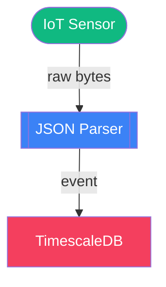

# Choreo

[](https://hex.pm/packages/choreo)
[](https://hexdocs.pm/choreo/)
[](https://github.com/code-shoily/choreo/actions)
[](https://coveralls.io/github/code-shoily/choreo?branch=main)
[](https://opensource.org/licenses/MIT)

> Domain-specific diagram builders and graph analyzers on top of [Yog](https://github.com/code-shoily/yog_ex).

Choreo is a family of Elixir libraries that let you model, analyze, and render complex systems as graphs. Instead of drawing boxes and arrows by hand, you write code. Instead of static pictures, you get live analysis — reachability, cycles, bottlenecks, threat generation, and more.

```elixir
alias Choreo.Dataflow

# A dataflow pipeline with one line of analysis
pipeline =
  Dataflow.new()
  |> Dataflow.add_source(:sensor, label: "IoT Sensor")
  |> Dataflow.add_transform(:parse, label: "JSON Parser")
  |> Dataflow.add_sink(:db, label: "TimescaleDB")
  |> Dataflow.connect(:sensor, :parse, data_type: "raw bytes")
  |> Dataflow.connect(:parse, :db, data_type: "event")

Dataflow.Analysis.cyclic?(pipeline)      #=> false
Dataflow.to_mermaid(pipeline)            #=> Mermaid diagram
```



---

## Installation

Add `choreo` to your `mix.exs`:

```elixir
def deps do
  [
    {:choreo, "~> 0.13"}
  ]
end
```

---

## Detailed Guides

Choreo supports 16 different artifact modeling vocabularies. They are categorized and detailed in the following guides and references:

1. **[Architecture & Design Modeling](guides/architecture_and_design.md)**
   * System Architecture (`Choreo`)
   * Cloud Network Topology (`Choreo.Infrastructure`)
   * C4 Model Architecture (`Choreo.C4`)
   * STRIDE Threat Modeling (`Choreo.ThreatModel`)
   * Domain-Driven Design & Event Storming (`Choreo.Domain`)
   * Database ERD Design (`Choreo.ERD`)
   * UML Class & Struct Diagrams (`Choreo.UML`)
   * Requirements Engineering & Traceability (`Choreo.Requirement`)

2. **[Behavior & Flow Modeling](guides/behavior_and_flows.md)**
   * Finite State Machines (`Choreo.FSM`)
   * Sequence Diagrams (`Choreo.Sequence`)
   * Saga Task Orchestration (`Choreo.Workflow`)
   * Dataflow Pipelines (`Choreo.Dataflow`)

3. **[Data & Structure Modeling](guides/data_and_structure.md)**
   * Software Dependency Graphs (`Choreo.Dependency`)
   * Decision Trees (`Choreo.DecisionTree`)
   * Concept Mapping / Mind Maps (`Choreo.MindMap`)
   * Project Task Planning (`Choreo.Planner`)

4. **[Analysis Algorithms Reference](guides/ALGORITHMS.md)**
   * Catalog of graph algorithms used by each analysis module
   * Function-to-algorithm mapping for every diagram type

5. **[Lab DSL & Sketch Syntax](guides/lab_dsl.md)** ([Cheatsheet](guides/lab_cheatsheet.md))
   * Experimental Livebook-friendly macro DSLs for sketching models across all domains
   * Compact syntax with variable binding, directional operators (`~>`), and pipe modifiers

---

## Interactive Notebooks

The `livebooks/` directory contains 30+ interactive walkthroughs, integration examples, and complete system designs that you can run directly in [Livebook](https://livebook.dev/):

- **[`livebooks/guides/`](https://github.com/code-shoily/choreo/tree/main/livebooks/guides)** — step-by-step introductions to each Choreo module and diagram type:
  - Walkthroughs for all 15 domains: C4, Dataflow, Sequence, Threat Model, ERD, FSM, Workflow, Dependency, Decision Tree, Domain Modeling, Mind Map, Planner, Requirement, Infrastructure, and UML.
  - [System Design Walkthrough](https://github.com/code-shoily/choreo/blob/main/livebooks/guides/system_design_walkthrough.livemd) — end-to-end design session composing C4, Dataflow, Workflow, and Threat Model.
  - [Advanced Analysis Walkthrough](https://github.com/code-shoily/choreo/blob/main/livebooks/guides/advanced_analysis_walkthrough.livemd) — centralities, heatmaps, cycle detection, and graph decomposition.
  - [Lab Visualization Walkthrough](https://github.com/code-shoily/choreo/blob/main/livebooks/guides/lab_visualization_walkthrough.livemd) — interactive Siren pan/zoom controls and Sketch (Excalidraw) whiteboards.
- **[`livebooks/projects/`](https://github.com/code-shoily/choreo/tree/main/livebooks/projects)** — complete, multi-perspective system design notebooks:
  - [API Gateway System Design](https://github.com/code-shoily/choreo/blob/main/livebooks/projects/api_gateway_system_design.livemd) — C4 context/container, dataflow, token-refresh saga workflow, STRIDE threat model, and review prompts.
  - [Real-Time Vehicle Tracking System](https://github.com/code-shoily/choreo/blob/main/livebooks/projects/vehicle_tracking_system.livemd) — IoT ingestion platform with ERD, C4, dataflow, sequence, trip saga, vehicle FSM, threat model, and requirements.
  - [Distributed Web Crawler](https://github.com/code-shoily/choreo/blob/main/livebooks/projects/web_crawler_system_design.livemd) — web crawler architecture with C4, crawl dataflow, fetch saga, ERD, threat model, and requirements traceability.
- **[`livebooks/integrations/`](https://github.com/code-shoily/choreo/tree/main/livebooks/integrations)** — notebooks that bridge Choreo with third-party tools, formats, and data sources:
  - [Finitomata](https://github.com/code-shoily/choreo/blob/main/livebooks/integrations/choreo_finitomata.livemd) — design FSMs in Choreo, run them with Finitomata, and analyze them back in Choreo.
  - [GitHub Issues](https://github.com/code-shoily/choreo/blob/main/livebooks/integrations/github_issues_explorer.livemd) — turn a public repo's issues into a Planner and Mind Map.
  - [Hex Dependencies](https://github.com/code-shoily/choreo/blob/main/livebooks/integrations/hex_dependency_explorer.livemd) — crawl any Hex package's dependency tree.
  - [Mix Xref](https://github.com/code-shoily/choreo/blob/main/livebooks/integrations/mix_xref_explorer.livemd) — visualize and analyze internal Elixir project dependencies.
  - [Ecto Schema ERD](https://github.com/code-shoily/choreo/blob/main/livebooks/integrations/ecto_schema_erd.livemd) — introspect Ecto schemas and render them as an interactive ERD.
  - [Requirements Exchange](https://github.com/code-shoily/choreo/blob/main/livebooks/integrations/requirements_exchange.livemd) — import and analyze requirements from CSV, JIRA, and IBM DOORS modules.
  - [YogEx Algorithm Selector](https://github.com/code-shoily/choreo/blob/main/livebooks/integrations/yogex_algorithm_selector.livemd) — interactive decision tree guiding you to the right YogEx graph algorithm.
- **[`livebooks/extending_choreo/`](https://github.com/code-shoily/choreo/tree/main/livebooks/extending_choreo)** — tutorials that walk through adding new diagram types, analysis vocabularies, and protocol implementations to Choreo:
  - [Git Graph](https://github.com/code-shoily/choreo/blob/main/livebooks/extending_choreo/git_graph.livemd) — extend Choreo with a Mermaid `gitGraph` renderer, from builder to real `git log` adapter.
  - [Call Graph Analysis](https://github.com/code-shoily/choreo/blob/main/livebooks/extending_choreo/call_graph_analysis.livemd) — extend Choreo with an analysis-first call graph: dead functions, cycles, hotspots, and impact analysis.
  - [FSM Viewable](https://github.com/code-shoily/choreo/blob/main/livebooks/extending_choreo/fsm_viewable.livemd) — add `Choreo.Viewable` support to `Choreo.FSM` so it can be zoomed, focused, and filtered.

---

## Graph Analysis & Heatmaps

Choreo provides graph analysis tools to identify "hotspots" in your architecture, workflows, and pipelines. Use `heatmap/2` to automatically color nodes based on importance or performance metrics.

| Metric | Measure | Question | Best for |
|--------|---------|----------|----------|
| **Structural Importance** | Betweenness Centrality | "Which nodes are critical bridges/connectors?" | `Choreo`, `Dependency` |
| **Connectivity** | Degree Centrality | "Which nodes have the most connections?" | `MindMap`, `Dependency` |
| **SPOF Detection** | Articulation Points | "Which nodes would disconnect the system if they failed?" | `Choreo`, `Dataflow` |
| **Nucleus Detection** | K-Core Decomposition | "Which nodes form the most tightly-coupled core?" | `Choreo`, `Dependency` |
| **Dependency Reduction** | Transitive Reduction | "What is the minimal set of dependencies that preserve reachability?" | `Dependency` |
| **Path Analysis** | Dijkstra / Widest Path | "What is the fastest or highest-throughput path between two points?" | `Workflow`, `Dataflow` |
| **Execution Hotspots** | Latency Heatmap | "Which tasks slow down the entire workflow?" | `Workflow` |
| **Volume Hotspots** | Throughput Heatmap | "Which stages handle the most data volume?" | `Dataflow` |
| **Security Hotspots** | Risk Heatmap | "Which components have the most security threats?" | `ThreatModel` |

---

## Themes & Rendering

All modules render to **DOT (Graphviz)** and **Mermaid.js** via a shared theming pipeline.

```elixir
# DOT output (Graphviz)
Choreo.to_dot(system, theme: :default)
Choreo.to_dot(system, theme: :dark)

# Mermaid.js output (GitHub, GitLab, Notion, Livebook)
Choreo.to_mermaid(system, theme: :default)
Choreo.to_mermaid(system, theme: :ocean)

# Custom theme
theme = Choreo.Theme.custom(
  colors: %{database: "#ff0000", service: "#00ff00"},
  graph_bgcolor: "#0f172a",
  node_fontcolor: "white"
)
Choreo.to_dot(system, theme: theme)
Choreo.to_mermaid(system, theme: theme)
```

---

## Interactive Livebook Widgets (Experimental)

Choreo provides two custom [Livebook](https://livebook.dev/) widgets for rich, interactive diagram visualizations. They are compile-time optional and load automatically when `kino` is present:

1. **`Choreo.Lab.Siren`**: An enhanced Mermaid.js renderer (Mermaid v11.x) with hardware-accelerated pan/zoom controls, floating zoom toolbar, dynamic fit-to-screen scaling, and automatic dark/light theme detection.
   ```elixir
   mermaid_code = Choreo.to_mermaid(system)
   Choreo.Lab.Siren.new(mermaid_code, height: "600px")
   ```

2. **`Choreo.Lab.Sketch`**: Renders any Mermaid flowchart inside an interactive **Excalidraw** whiteboard. The diagram is converted to sketch elements on the fly, allowing you to double-click, draw notes, and scribble ideas directly on top of your Choreo models.
   ```elixir
   Choreo.Lab.Sketch.new(mermaid_code, height: "600px")
   ```

---

## MCP Server for Agents

Choreo ships with a zero-dependency stdio MCP server so agents can read, write, and verify system-design notebooks using the same validation logic as `mix choreo.test_livebooks`. Run it from the Choreo repo:

```bash
mix choreo.mcp
```

It exposes four tools over JSON-RPC:

| Tool | Purpose |
|------|---------|
| `choreo_initialize_design_notebook` | Scaffold a new design notebook under `livebooks/projects/<name>_system_design.livemd`. |
| `choreo_read_design_notebook` | Parse a notebook into sections and code cells. |
| `choreo_update_design_section` | Replace the body of an existing section by exact header match. |
| `choreo_verify_design` | Evaluate every Elixir cell headlessly and report runtime errors or design issues. |

### Configuring a client

For example, in Claude Desktop add this to `claude_desktop_config.json` (replace `/path/to/choreo` with your local clone):

```json
{
  "mcpServers": {
    "choreo": {
      "command": "sh",
      "args": ["-c", "cd /path/to/choreo && exec mix choreo.mcp"]
    }
  }
}
```

### Example prompts

- "Initialize a system-design notebook for a real-time URL shortener at `livebooks/projects/url_shortener_system_design.livemd`."
- "Read the C4 Context and C4 Container sections from `livebooks/projects/api_gateway_system_design.livemd`."
- "Add a Dataflow section to the URL-shortener notebook showing clients → API → cache → database."
- "Verify the URL-shortener notebook and report any runtime errors or design issues."

---

## CLI Tools

Choreo includes Mix tasks for diagram rendering and notebook verification:

```bash
# Render .choreo.exs files directly to Mermaid (.mmd) or Graphviz DOT (.dot)
mix choreo.render diagrams/system.choreo.exs --to mermaid --out priv/diagrams/

# Headlessly evaluate and validate all Livebook notebooks
mix choreo.test_livebooks
```

---

## Testing

```bash
mix test
```

All modules ship with comprehensive ExUnit test suites covering builders, analysis, rendering, and doctests.

---

## License

MIT
