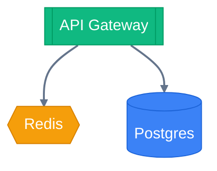
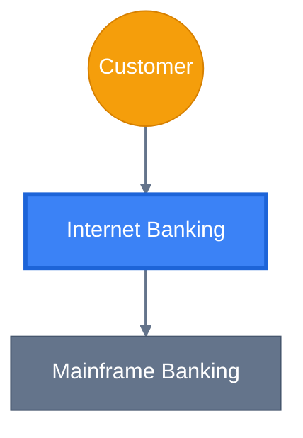
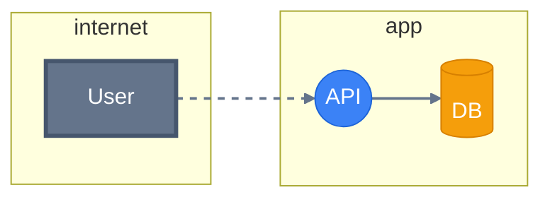
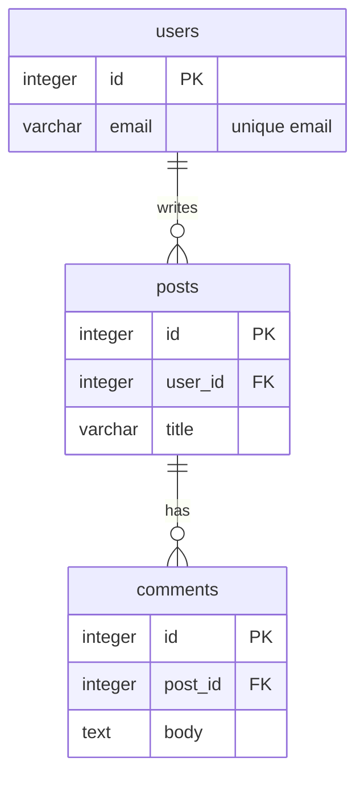
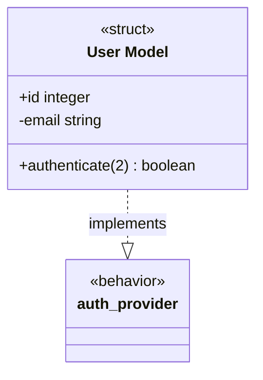

# Architecture & Design Modeling

Choreo provides powerful tools for modeling, analyzing, and rendering system architectures, database designs, security boundaries, and code structures.

---

## Choreo — System Architecture

Model systems with typed infrastructure nodes: databases, caches, services, queues, load balancers, networks, users, storage, compute, and managed databases. Use this for general service-level and system architecture diagrams.

```elixir
alias Choreo

system =
  Choreo.new()
  |> Choreo.add_database(:db, label: "Postgres", kind: :postgres)
  |> Choreo.add_cache(:cache, label: "Redis")
  |> Choreo.add_service(:api, label: "API Gateway")
  |> Choreo.connect(:api, :cache, cost: 5)
  |> Choreo.connect(:api, :db, cost: 10)

# Analysis
{:ok, mst} = Choreo.Analysis.mst(system)
{:ok, order} = Choreo.Analysis.topological_sort(system)

# Render
dot = Choreo.to_dot(system, theme: :dark)
mermaid = Choreo.to_mermaid(system)
```

**Features:** clusters with nesting (including typed VPC/subnet boundaries), dataflow edges, cost-weighted edges, MST, topological sort, SCC, theming, cross-diagram embedding and tracing.



---

## Choreo.Infrastructure — Cloud Network Topology

A domain-specific vocabulary layer on top of `Choreo` for modeling cloud network topologies with VPCs, subnets, compute instances, managed databases, and load balancers. It shares the same rendering pipeline and data model as `Choreo` but adds security-aware analysis rules.

Use `Choreo.Infrastructure` when you need:
- **Typed cluster boundaries** — VPCs, public subnets, and private subnets with security semantics
- **Security audits** — automatic checks for direct internet-to-private links, misplaced databases, and exposed storage
- **Cloud vocabulary** — `add_vpc/3`, `add_compute/3`, `add_managed_db/3`, `add_subnet_public/3`, etc.

```elixir
alias Choreo.Infrastructure

infra =
  Infrastructure.new()
  |> Infrastructure.add_vpc("vpc_main", label: "Production VPC")
  |> Infrastructure.add_subnet_public("dmz", label: "Public DMZ", parent: "vpc_main")
  |> Infrastructure.add_subnet_private("app", label: "App Tier", parent: "vpc_main")
  |> Infrastructure.add_load_balancer(:alb, label: "ALB", cluster: "dmz")
  |> Infrastructure.add_compute(:api, label: "API", cluster: "app")
  |> Infrastructure.add_managed_db(:db, label: "Postgres RDS", cluster: "app")
  |> Infrastructure.connect(:alb, :api)
  |> Infrastructure.connect(:api, :db)

# Security audit
Choreo.Infrastructure.Analysis.validate(infra)
# => []  (or [{:error, ...}, {:warning, ...}] if violations found)
```

**Note:** `Choreo.Infrastructure` is a thin wrapper over `Choreo` — it uses the same struct fields, rendering pipeline, and theming system. You can embed an `Infrastructure` diagram into a top-level `Choreo` diagram and it will render seamlessly.

---

## Choreo.C4 — C4 Model Architecture

Model software architecture at multiple zoom levels — from system context down to components — in a single unified graph.

```elixir
alias Choreo.C4
alias Choreo.C4.Analysis

c4 =
  C4.new()
  |> C4.add_person(:customer, label: "Customer")
  |> C4.add_software_system(:banking,
    label: "Internet Banking",
    scope: :in,
    description: "Allows customers to view balances and make payments"
  )
  |> C4.add_software_system(:mainframe,
    label: "Mainframe Banking",
    description: "Stores all core banking information"
  )
  |> C4.add_container(:web_app,
    label: "Web Application",
    technology: "JavaScript",
    parent: :banking
  )
  |> C4.add_container(:api,
    label: "API Application",
    technology: "Elixir/Phoenix",
    parent: :banking
  )
  |> C4.add_component(:accounts_ctx,
    label: "Accounts Context",
    technology: "Elixir",
    parent: :api
  )
  |> C4.relationship(:customer, :banking, label: "Views account balances")
  |> C4.relationship(:banking, :mainframe, label: "Gets account info")

# Zoom to a specific C4 level
C4.to_mermaid(Choreo.View.zoom(c4, level: 0)) # System Context
C4.to_mermaid(Choreo.View.zoom(c4, level: 1)) # Container diagram
C4.to_mermaid(Choreo.View.zoom(c4, level: 2)) # Component diagram

# Analysis
Analysis.missing_descriptions(c4)
Analysis.isolated_nodes(c4)
Analysis.validate(c4)
```

**Features:** L1–L3 C4 modeling (System Context, Containers, Components), zoom-aware rendering, parent/child clustering, missing metadata detection, isolated node detection.



---

## Choreo.ThreatModel — STRIDE Threat Modeling

Extend dataflow diagrams with security semantics. Auto-generate STRIDE threats based on element types, trust boundaries, and encryption status.

```elixir
alias Choreo.ThreatModel
alias Choreo.ThreatModel.Analysis

model =
  ThreatModel.new()
  |> ThreatModel.add_trust_boundary("internet", level: 0)
  |> ThreatModel.add_trust_boundary("app", level: 2)
  |> ThreatModel.add_external_entity(:user, boundary: "internet", label: "User")
  |> ThreatModel.add_process(:api, boundary: "app", privilege: :admin, label: "API")
  |> ThreatModel.add_data_store(:db, boundary: "app", sensitivity: :confidential, label: "DB")
  |> ThreatModel.data_flow(:user, :api)
  |> ThreatModel.data_flow(:api, :db, encrypted: true)

# Auto-generated threats
threats = Analysis.stride_threats(model)

# Security analysis
Analysis.exposed_data_stores(model)
Analysis.high_risk_processes(model)
Analysis.unencrypted_boundary_flows(model)

# Sequence diagram
ThreatModel.to_sequence(model)  #=> Mermaid sequenceDiagram string
```

**Features:** automated STRIDE threat generation with severity scoring, trust-boundary crossing detection, exposed-data-store identification, high-risk process detection, encrypted-flow detection, sequence diagram generation.



---

## Choreo.Domain — DDD & Event Storming Domain Modeling

Model complex domains using Event Storming syntax and Strategic Context Mapping. Declare bounded contexts, aggregates, commands, events, sagas/policies, and Scott Wlaschin-style algebraic data types (ADTs) and workflows.

```elixir
alias Choreo.Domain
alias Choreo.Domain.Analysis

model =
  Domain.new()
  |> Domain.add_context_boundary("ordering", label: "Ordering Bounded Context")
  |> Domain.add_aggregate(:order_agg, label: "Order Aggregate", parent: "ordering")
  |> Domain.add_command(:place_order, label: "Place Order")
  |> Domain.add_event(:order_placed, label: "Order Placed")
  |> Domain.connect(:place_order, :order_agg, label: "handles")
  |> Domain.connect(:order_agg, :order_placed, label: "publishes")

# Strategic Context Mapping
context_map =
  Domain.new()
  |> Domain.add_context(:ordering, label: "Ordering Service")
  |> Domain.add_context(:billing, label: "Billing Service")
  |> Domain.connect_contexts(:ordering, :billing, type: :acl, label: "Upstream -> Downstream")

# Render
mermaid = Domain.to_mermaid(model)
```

**Features:** bounded contexts, aggregates, command-event separation, anti-corruption layers (ACL), algebraic data type tables (ADTs), workflows, strategic context maps, validation.

---

## Choreo.ERD — Database Entity-Relationship Modeling

Model database schemas, validate data integrity constraints, render beautiful HTML-like tables or native Mermaid `erDiagram` syntaxes, and run advanced topological analysis.

```elixir
alias Choreo.ERD
alias Choreo.ERD.Analysis

erd =
  ERD.new()
  |> ERD.add_table(:users, columns: [
    %{name: :id, type: :integer, key: :pk},
    %{name: :email, type: :varchar, comment: "unique email"}
  ])
  |> ERD.add_table(:posts, columns: [
    %{name: :id, type: :integer, key: :pk},
    %{name: :user_id, type: :integer, key: :fk},
    %{name: :title, type: :varchar}
  ])
  |> ERD.add_table(:comments, columns: [
    %{name: :id, type: :integer, key: :pk},
    %{name: :post_id, type: :integer, key: :fk},
    %{name: :body, type: :text}
  ])
  |> ERD.add_relationship(:users, :posts, cardinality: :one_to_many, label: "writes")
  |> ERD.add_relationship(:posts, :comments, cardinality: :one_to_many, label: "has")

# Topological Analysis
Analysis.shortest_join_path(erd, :users, :comments) #=> {:ok, [:users, :posts, :comments]}
Analysis.cycles(erd)                              #=> [] (no circular foreign keys!)
Analysis.orphans(erd)                             #=> []
Analysis.table_degrees(erd)                       #=> %{users: %{in: 0, out: 1, total: 1}, ...}
```

**Features:** strict columns and relationship validation, customizable themed HTML record labels in DOT output, native Mermaid `erDiagram` generation, undirected BFS join path solver, DFS circular foreign key cycle detection, orphan and coupling metrics.



---

## Choreo.UML — Class & Struct Diagrams

Model software module contracts, behaviors, protocols, structs, their fields, arities, and visibilities, and declare exact structural relations with visual parity.

```elixir
alias Choreo.UML

uml =
  UML.new()
  |> UML.add_class(:user,
    type: :struct,
    label: "User Model",
    fields: [
      %{name: :id, type: :integer, visibility: :public},
      %{name: :email, type: :string, visibility: :private}
    ],
    functions: [
      %{name: "authenticate", arity: 2, return: :boolean, visibility: :public}
    ]
  )
  |> UML.add_class(:auth_provider, type: :behavior)
  |> UML.add_relationship(:user, :auth_provider, type: :realizes, label: "implements")

# Render to native Mermaid class diagram
UML.to_mermaid(uml, syntax: :class_diagram)
```

**Features:** multi-compartment record tables, standard visibility markers (`+`, `-`, `#`), functional contracts, protocol realization, behavior adoption, lens focusing via `Choreo.View`.


