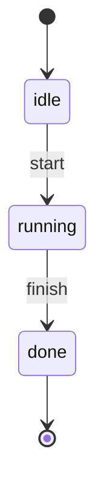
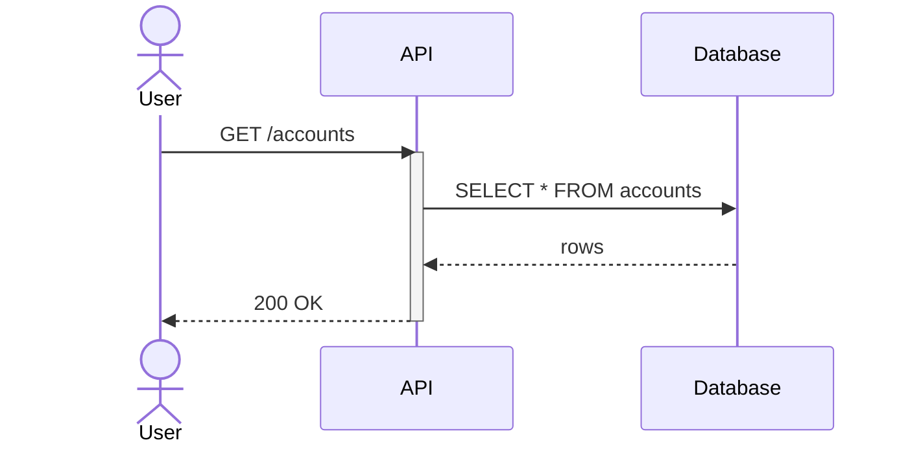
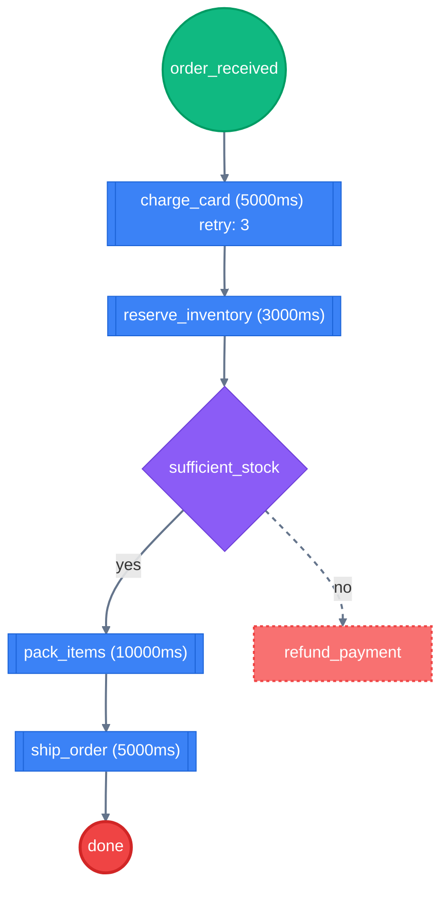
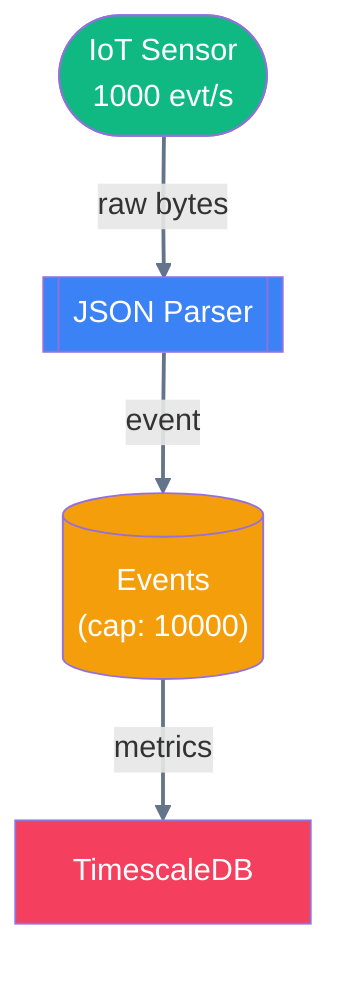

# Behavior & Flow Modeling

Choreo provides tools for modeling, executing, analyzing, and rendering behavioral states, sequence diagrams, task orchestrations, and dataflow processing pipelines.

---

## Choreo.FSM — Finite State Machines

Classic state machines with initial states, final states, and labeled transitions.

```elixir
alias Choreo.FSM

fsm =
  FSM.new()
  |> FSM.add_initial_state(:idle)
  |> FSM.add_state(:running)
  |> FSM.add_final_state(:done)
  |> FSM.add_transition(:idle, :running, label: "start")
  |> FSM.add_transition(:running, :done, label: "finish")

# Analysis
FSM.Analysis.accepts?(fsm, ["start", "finish"])  #=> true
FSM.Analysis.shortest_accepting_path(fsm)         #=> {:ok, ["start", "finish"]}

# Render to native state diagram
FSM.to_mermaid(fsm, syntax: :state_diagram)
```

**Features:** Deterministic execution, reachability, dead-state detection, complement, product construction, equivalence checking.



---

## Choreo.Sequence — Sequence Diagrams

Model ordered interactions between participants over time. Mermaid-native output with activation boxes, notes, and fragments.

```elixir
alias Choreo.Sequence

seq =
  Sequence.new()
  |> Sequence.add_actor(:user, label: "User")
  |> Sequence.add_participant(:api, label: "API")
  |> Sequence.add_participant(:db, label: "Database")
  |> Sequence.message(:user, :api, label: "GET /accounts")
  |> Sequence.activate(:api)
  |> Sequence.message(:api, :db, label: "SELECT * FROM accounts")
  |> Sequence.return(:db, :api, label: "rows")
  |> Sequence.deactivate(:api)
  |> Sequence.return(:api, :user, label: "200 OK")

Sequence.to_mermaid(seq)
Sequence.to_dot(seq)        # Best-effort timeline fallback
```

**Features:** actors/participants, sync/async/return/self messages, activation boxes, notes, loops/alts/opts, missing-label detection, unbalanced activation detection.



---

## Choreo.Workflow — Task Orchestration

Model automated task orchestration with Saga-pattern compensations, timeouts, retries, and conditional branching.

```elixir
alias Choreo.Workflow
alias Choreo.Workflow.Analysis

workflow =
  Workflow.new()
  |> Workflow.add_start(:order_received)
  |> Workflow.add_task(:charge_card, timeout_ms: 5000, retry: 3)
  |> Workflow.add_task(:reserve_inventory, timeout_ms: 3000)
  |> Workflow.add_decision(:sufficient_stock)
  |> Workflow.add_task(:pack_items, timeout_ms: 10_000)
  |> Workflow.add_task(:ship_order, timeout_ms: 5000)
  |> Workflow.add_compensation(:refund_payment, for: :charge_card)
  |> Workflow.add_end(:done)
  |> Workflow.connect(:order_received, :charge_card)
  |> Workflow.connect(:charge_card, :reserve_inventory)
  |> Workflow.connect(:reserve_inventory, :sufficient_stock)
  |> Workflow.connect(:sufficient_stock, :pack_items, condition: "yes")
  |> Workflow.connect(:sufficient_stock, :refund_payment, condition: "no", edge_type: :compensation)
  |> Workflow.connect(:pack_items, :ship_order)
  |> Workflow.connect(:ship_order, :done)

# Analysis
Analysis.critical_path(workflow)
#=> {:ok, [:order_received, :charge_card, ...], 23000}

Analysis.parallelizable_tasks(workflow)
Analysis.missing_compensations(workflow)
Analysis.validate(workflow)
```

**Features:** critical-path analysis with latency weights, parallelizable-task grouping, failure-scenario detection, missing-compensation detection, bottleneck detection, execution simulation.



---

## Choreo.Dataflow — Pipeline Diagrams

Model stream-processing and ETL pipelines. Nodes are sources, transforms, buffers, conditionals, merges, and sinks.

```elixir
alias Choreo.Dataflow

pipeline =
  Dataflow.new()
  |> Dataflow.add_source(:sensor, label: "IoT Sensor", rate: 1000)
  |> Dataflow.add_transform(:parse, label: "JSON Parser", latency_ms: 50)
  |> Dataflow.add_buffer(:kafka, label: "Events", capacity: 10_000)
  |> Dataflow.add_sink(:db, label: "TimescaleDB")
  |> Dataflow.connect(:sensor, :parse, data_type: "raw bytes")
  |> Dataflow.connect(:parse, :kafka, data_type: "event")
  |> Dataflow.connect(:kafka, :db, data_type: "metrics")

# Analysis
Dataflow.Analysis.cyclic?(pipeline)           #=> false
{:ok, order} = Dataflow.Analysis.topological_sort(pipeline)
Dataflow.Analysis.orphan_nodes(pipeline)       #=> []
Dataflow.Analysis.bottlenecks(pipeline)        #=> [:kafka]
Dataflow.Analysis.simulate(pipeline)           #=> throughput map
{:ok, path, latency} = Dataflow.Analysis.longest_path(pipeline)
```

**Features:** error/retry/dead-letter path types, sub-pipeline clusters, throughput simulation, backpressure detection, critical-path analysis.


