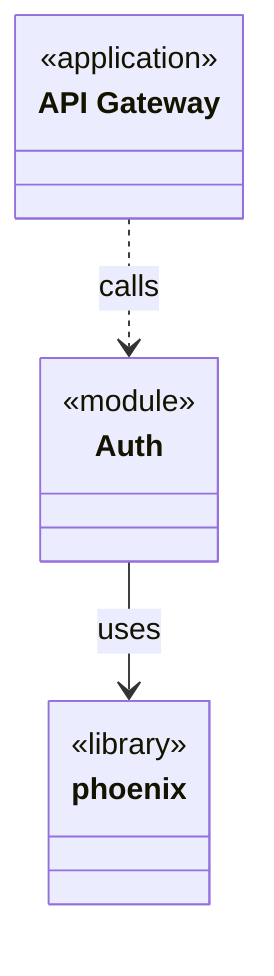
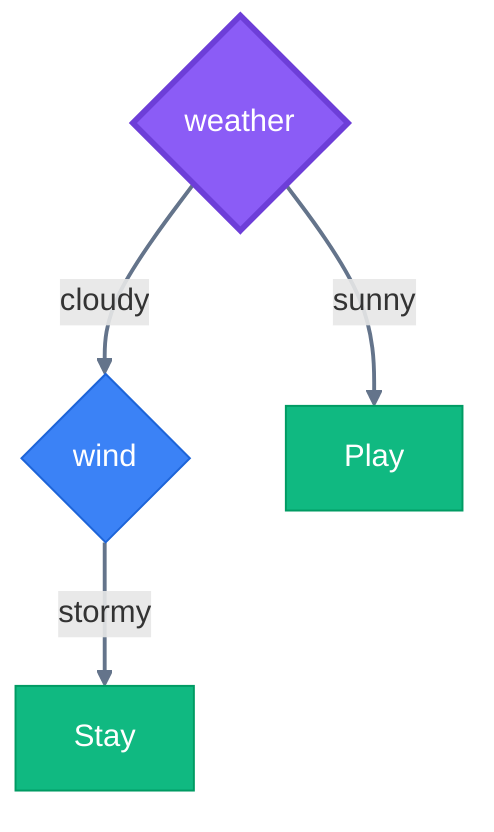
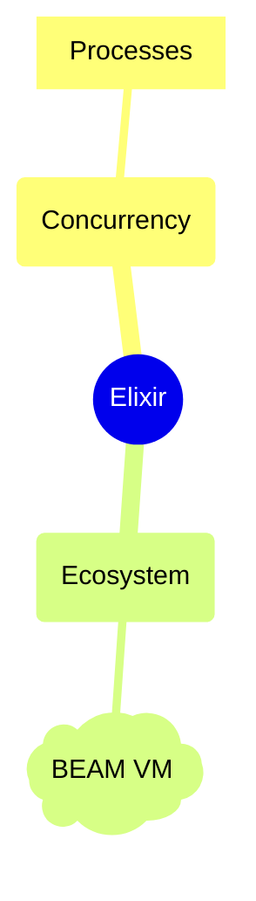
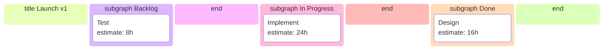

# Data & Structure Modeling

Choreo provides builders, visualizers, and analyzers for database designs, class diagrams, dependency structures, classification trees, hierarchical mind maps, and project tasks.

---

## Choreo.Dependency — Software Dependency Graphs

Map modules, libraries, applications, interfaces, and tests. Detect circular dependencies, layering violations, and impact zones.

```elixir
alias Choreo.Dependency

deps =
  Dependency.new()
  |> Dependency.add_application(:api, label: "API Gateway")
  |> Dependency.add_module(:auth, label: "Auth")
  |> Dependency.add_library(:phoenix)
  |> Dependency.depends_on(:api, :auth, type: :calls)
  |> Dependency.depends_on(:auth, :phoenix, type: :uses)

# Analysis
Dependency.Analysis.cyclic_dependencies(deps)     #=> []
Dependency.Analysis.affected_by(deps, :auth)       #=> [:api]
Dependency.Analysis.depends_on(deps, :api)         #=> [:auth, :phoenix]

# Render to native class diagram
Dependency.to_mermaid(deps, syntax: :class_diagram)
```

**Features:** cycle path extraction (not just boolean), transitive impact analysis, layer violation detection, centrality ranking, longest dependency chain, cycle edge highlighting in DOT.



---

## Choreo.DecisionTree — Classification Trees

Build decision trees with enforced tree invariants (single root, single parent, no cycles).

```elixir
alias Choreo.DecisionTree
alias Choreo.DecisionTree.Analysis

tree =
  DecisionTree.new()
  |> DecisionTree.set_root(:weather, feature: "weather")
  |> DecisionTree.add_decision(:wind, feature: "wind")
  |> DecisionTree.add_outcome(:play, label: "Play", class: "yes")
  |> DecisionTree.add_outcome(:stay, label: "Stay", class: "no")
  |> DecisionTree.branch(:weather, :wind, "cloudy")
  |> DecisionTree.branch(:weather, :play, "sunny")
  |> DecisionTree.branch(:wind, :stay, "stormy")

# Evaluation
Analysis.decide(tree, %{"weather" => "cloudy", "wind" => "calm"})
#=> {:ok, [:weather, :wind, ...], "..."}

# Metrics
Analysis.paths(tree)               #=> all root-to-leaf paths
Analysis.depth(tree)               #=> 2
Analysis.feature_importance(tree)  #=> %{"weather" => 1, "wind" => 1}

# Optimization
pruned = Analysis.prune_redundant(tree)
```

**Features:** exact-match decision evaluation, path enumeration with conditions, redundant-branch pruning, feature-importance counting, tree validation.



---

## Choreo.MindMap — Concept Mapping

Model hierarchical concept maps with a central root, branching topics and subtopics, and associative cross-links.

```elixir
alias Choreo.MindMap
alias Choreo.MindMap.Analysis

map =
  MindMap.new()
  |> MindMap.set_root(:elixir, label: "Elixir")
  |> MindMap.add_topic(:concurrency, label: "Concurrency")
  |> MindMap.add_topic(:ecosystem, label: "Ecosystem")
  |> MindMap.add_subtopic(:processes, label: "Processes")
  |> MindMap.add_note(:beam, label: "BEAM VM")
  |> MindMap.branch(:elixir, :concurrency)
  |> MindMap.branch(:elixir, :ecosystem)
  |> MindMap.branch(:concurrency, :processes)
  |> MindMap.branch(:ecosystem, :beam)
  |> MindMap.associate(:processes, :beam, label: "runs on")

# Analysis
Analysis.depth(map)          #=> 2
Analysis.breadth(map)        #=> 2
Analysis.orphan_nodes(map)   #=> []
Analysis.paths(map)          #=> [[:elixir, :concurrency, :processes], [:elixir, :ecosystem, :beam]]
Analysis.validate(map)       #=> []
```

**Features:** single-root invariant, branch and associate edge types, depth/breadth/width metrics, root-to-leaf path enumeration, orphan detection, cycle detection, type-frequency analysis, validation.



---

## Choreo.Planner — Project Planning

Model projects with tasks, milestones, users, and labels. Render as Kanban boards, Gantt charts, or dependency flowcharts.

```elixir
alias Choreo.Planner
alias Choreo.Planner.Analysis

project =
  Planner.new("Launch v1")
  |> Planner.add_milestone(:v1, title: "V1 Launch")
  |> Planner.add_task(:design, title: "Design", status: :done, estimate_hours: 16)
  |> Planner.add_task(:impl, title: "Implement", status: :in_progress, estimate_hours: 24)
  |> Planner.add_task(:test, title: "Test", status: :backlog, estimate_hours: 8)
  |> Planner.add_user(:alice, name: "Alice")
  |> Planner.contains(:v1, :design)
  |> Planner.contains(:v1, :impl)
  |> Planner.contains(:v1, :test)
  |> Planner.depends_on(:impl, :design)
  |> Planner.depends_on(:test, :impl)
  |> Planner.assign(:design, :alice)

# Analysis
Analysis.ready(project)          #=> tasks with unmet dependencies satisfied
Analysis.blocked(project)        #=> tasks blocked by incomplete dependencies
Analysis.critical_path(project, milestone: :v1)
#=> {:ok, [:design, :impl, :test], total_estimate: 48}
Analysis.bottlenecks(project)    #=> high in-degree tasks

# Render
Planner.to_mermaid(project, syntax: :kanban)
Planner.to_mermaid(project, syntax: :gantt)
Planner.to_mermaid(project, syntax: :flowchart)
Planner.to_dot(project)
```

**Features:** Kanban (`kanban` / `kanban_compat`), Gantt, and flowchart rendering, milestone hierarchy, dependency and assignment tracking, ready/blocked/critical-path/bottleneck analysis, status and priority metadata.


